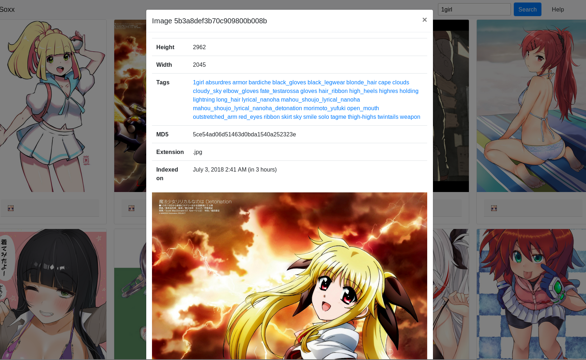

# Soxx!

As of now, we can index and scrape images from several popular imageboards
(as much as their API allows it) via a basic web interface admin panel. Adding
new imageboards with APIs ideantical to other popular ones is simple with the `scrappers.toml`
configuration file.

The image viewing part is somewhat better: you can view images either
right on the search page or their own page, you can search images by
excluding, including tags and regular expressions run on tags.

This project is done in Scala+Play+Akka, because I like actors and erlang :P

Please do suggest things and feel free to fork and contribute. Documentation
is a little lacking at the moment, but i will try to make it better in the future.

There's support for uploading images to S3-compaitable services, it is optional
and is disabled by default, but can be enabled and configured in application.conf.
As of now, images are indexed and you can then download them because indexing is much faster.

The tests will also be probably set up where appropriate.

To actually run this, you'll need to:

1. Install NodeJS+NPM and run `npm install` in the assets directory
2. Install MongoDB, make it a cluster in the settings and start it
3. Run `sbt` and then put `run` in there to start the dev environment

# Contributions

All contributions in any JVM language are welcome! This project may
not be scala-only if there are people interested in it but they also
don't want to learn scala (as it is pretty complex!).

# Screenshots

That's how the image embded in the search page looks right now (all pictures
belong to their respective authors)

